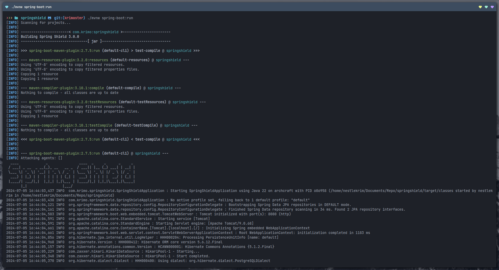
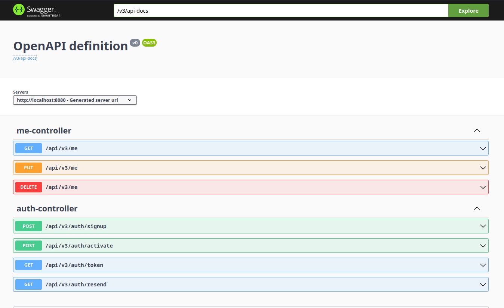

# Spring Shield - Spring Security Authkit



Technologies used:

* Spring Boot
* Spring Security
* Bucket4j
* PostgreSQL

### JWT-Based Security

This project utilizes JSON Web Tokens (JWT) to secure its resources.

 Following successful login, the client receives an `access token` for authorized API access and a `refresh token` for obtaining new access tokens.

#### Access Token

* Used for authorization purposes in API requests
* Required for accessing `api/v3/me` endpoint within the Authorization header format: `Bearer <access_token> `
* Has a 15-minute expiration time

#### Refresh Token

* Used to acquire a new access token when the current one expires
* Requires a valid refresh token for exchange within the Authorization header format: `Bearer <refresh_token> `
* Has a 14-day expiration time

_**Important Note: Access and refresh tokens have distinct validation mechanisms and cannot be used interchangeably.**_

### Rate Limiting

To enhance security against brute-force and denial-of-service (DoS) attacks, this project implements Bucket4j's token-based rate limiting on the **Login** and **Signup** handlers. This mechanism restricts the number of login and signup attempts allowed within a specific timeframe. Any further request will receive a **429 Too Many Requests** response status.

#### Public endpoints

| Endpoint              | Description               | Request Limit             |
|-----------------------|---------------------------|---------------------------|
|`v3/api-docs`          | View API Documentation    | N/A                       |  
|`swagger-ui/index.html`| View Swagger UI           | N/A                       |
|`api/v3/auth/login`    | Login user                | 5 requests per 15 minutes | 
|`api/v3/auth/signup`   | Register user             | 10 requests per day       |  

#### Protected endpoints

| Endpoint             | Description                           | Bearer Token Required |
|----------------------|---------------------------------------|-----------------------|
|`api/v3/auth/token`   | Fetch new access token                | Refresh Token         |
|`api/v3/auth/activate`| Activate email address                | Access Token          |
|`api/v3/auth/resend`  | Resend verification code              | Access Token          |
|`api/v3/me`           | Perform authenticated user operations | Access Token          | 

### Docker Compose

This section guides you through running the application alongside its database using Docker Compose.

**Prerequisite**

* Ensure you have Docker installed on your system.

**Instructions**

1. Navigate to the project's root directory in your terminal.

2. Run the following command to start the application and database containers in detached mode:


```
docker compose up -d
```

### API Documentation

This API enforces strict data validation on all request bodies to ensure data integrity and consistency.  Please refer to the API documentation for each endpoint to understand the expected data format (schema) for the request body.





